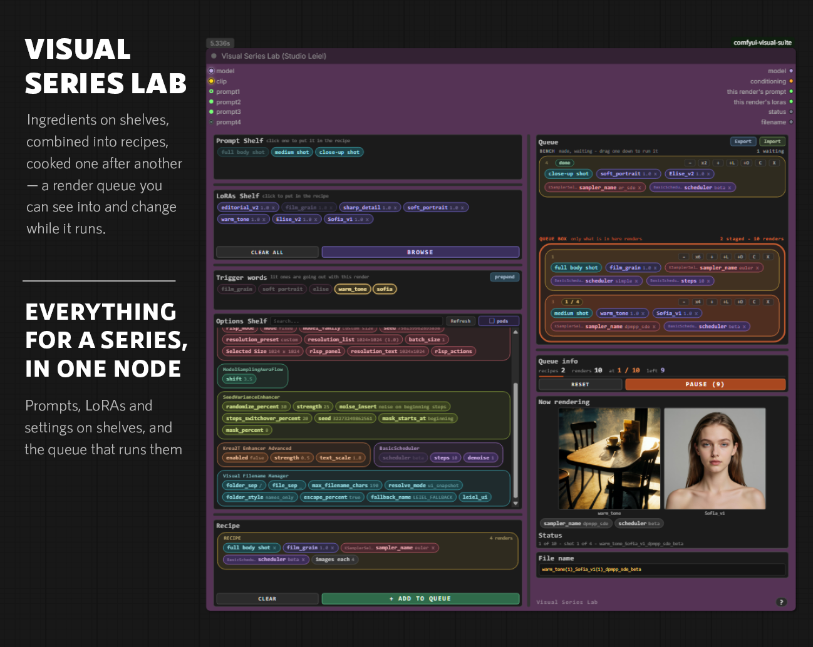
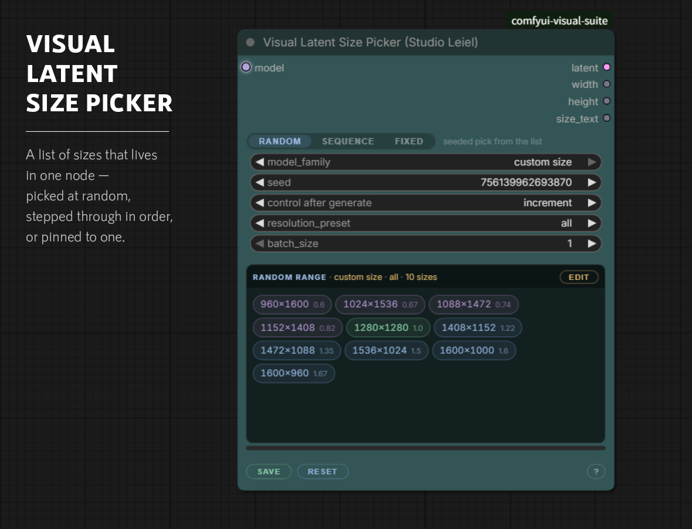
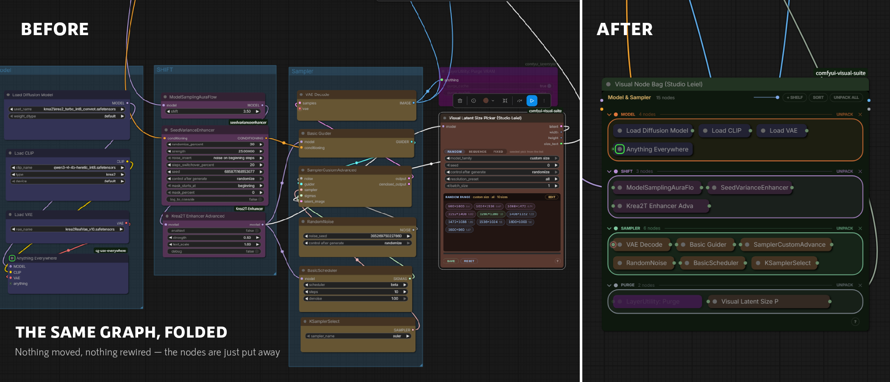

# Visual Suite (Studio Leiel)

Six nodes for ComfyUI, built for people who spend their day in the graph rather
than passing through it. They share one design language: the same palette, the
same chips, the same `?` button that opens a manual on the node itself.

## The nodes

### [Visual Prompt Composer](docs/prompt-composer.md)

Turns a prompt from a wall of text into a set of parts you can see, switch off,
rearrange and reuse.

A long prompt is a record of many decisions that all look alike once it is
saved. Styling gives it landmarks: you find the part you are changing instead of
rereading everything, you can see which sentences are doing the work, and you
can leave notes to yourself that are still there next week. None of it reaches
the model — the styling is metadata, the output is plain text — so it costs
nothing to annotate as much as you like.

Copy formatting between sections with the brush, save any part as a preset, and
read any of it back in 26 languages.


### [Visual Series Lab](docs/series-lab.md)

Ingredients on shelves, combined into recipes, cooked one after another — a
render queue you can see into and change while it runs.

A queued run is normally a sealed box: you cannot tell which of sixty renders
you are looking at, and you cannot change your mind without cancelling by hand.
Here every render says which prompt, which LoRAs and which settings made it,
while it happens — and a recipe can be pulled out, added, or given a bigger
count mid-run, with nothing already rendered repeated.



### [Visual Filename Manager](docs/filename-manager.md)

Names your renders after what made them — click any option in the workflow and
it becomes part of the folder or the file.

Twenty images called `ComfyUI_00017_` tell you nothing about which setting made
the one you liked. Building a useful name by hand takes dozens of nodes across
several packs, rewired every time you want a different setting in it. This reads
the workflow instead: every option is already listed, and a click puts it in the
folder or the file.


### [Visual Latent Size Picker](docs/latent-size-picker.md)

A list of sizes that lives in one node — picked at random, stepped through in
order, or pinned to one.

A node graph cannot hold a list, so ten sizes mean twenty nodes and two switches
to choose between them. Most workflows give up and settle on one aspect ratio.
This one keeps the sizes on disk instead: every workflow sees the same list,
adding one costs a line of typing, and width and height can never come apart.



### [Visual Node Bag](docs/node-bag.md)

Drop nodes into a bag and they fold into chips — without touching the graph.

Most of a workflow is finished and never needs looking at again, but it still
takes up the screen and runs wires across whatever you are working on. A bag
puts those nodes away where they are: same links, same ids, same execution. Sort
them onto named shelves, open one in place to change a widget, and delete the
bag whenever you like — every node comes back as it was.



### [Visual Crop](docs/crop.md)

Drag the crop on the picture itself, and watch it as you do.

Cropping in a node graph usually means typing four numbers, running the graph,
and adjusting. Here the picture is on the node: draw a box on it, and the
coordinates follow — with the result shown underneath as you drag.


## Install

Search for **Visual Suite (Studio Leiel)** in ComfyUI Manager, or clone into
`custom_nodes`:

```bash
cd ComfyUI/custom_nodes
git clone https://github.com/StudioLeiel/comfyui-visual-suite
```

Restart ComfyUI. No dependencies beyond what ComfyUI already ships.

## How the pack is put together

```
nodes/<name>/     one Python package per node
web/<name>/       its frontend, served from /extensions/comfyui-visual-suite/<name>/
```

Each node is imported separately. If one fails - a ComfyUI frontend change, a
bad edit - it is skipped with a message in the console and the other five still
load. The console line at startup says how many came up.

Nodes that keep state (prompt presets, series favourites, custom size lists)
write it to ComfyUI's `user/` directory, so updating or reinstalling the pack
never deletes it.

## A note on node ids

Display names are consistent; the internal class ids are not. `Visual Latent
Size Picker` is still `RandomLatentSizePicker` inside, because that is what it
shipped as a year ago and renaming it would break every workflow already using
it. The ids are invisible unless you read the workflow JSON.

## Nodes in this pack

| Display name | Class id |
| --- | --- |
| Visual Prompt Composer (Studio Leiel) | `LeielPromptComposer` |
| Visual Series Lab (Studio Leiel) | `VisualSeriesLabSetup` |
| Visual Filename Manager (Studio Leiel) | `LeielFilenameStudio` |
| Visual Latent Size Picker (Studio Leiel) | `RandomLatentSizePicker` |
| Visual Node Bag (Studio Leiel) | `VisualNodeBag` |
| Visual Crop (Studio Leiel) | `VisualCrop_StudioLeiel` |

## History

Visual Crop and Visual Filename Manager were published separately first, as
`comfyui_visual_crop` and `comfyui-visual-filename-manager`. Both are folded
into this pack; the old repositories are archived and point here.

## Licence

MIT. See [LICENSE](LICENSE).
