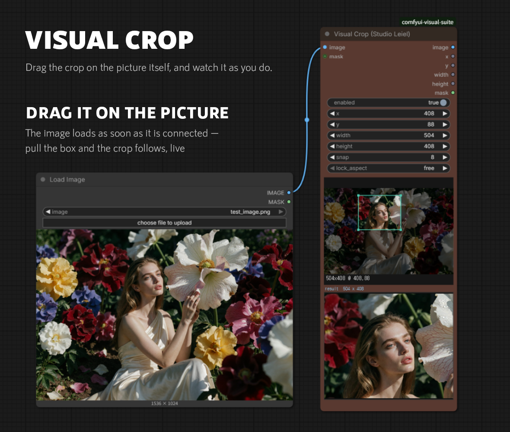

# Visual Crop

Drag the crop on the picture itself, and watch it as you do.

---

## Why not just type the numbers

Cropping in a node graph normally means guessing. You type an x, a y, a width
and a height into four fields, run the graph, look at what came out, and adjust.
The picture is right there on the loader node, but the numbers are somewhere
else, and nothing connects the two except your arithmetic.

For a centred crop of a known size that is fine. For anything judged by eye —
framing a face, cutting a detail out of a wide shot, keeping a horizon where you
want it — it is four fields and a round trip per attempt.

This node puts the box on the picture. Connect an image and it appears on the
node; drag a box on it and the numbers follow. The crop under the box updates as
you drag, so what you are choosing is visible before anything is run.

---

## Using it

Connect an `IMAGE` and the preview fills in. Drag inside it to draw a box, drag
the box to move it, drag an edge or a corner to resize. The numbers in `x`, `y`,
`width` and `height` follow, and typing into those fields moves the box the
other way — the two are the same thing seen from two sides.

The result of the crop is shown underneath the box, with its size, so the
picture you are actually going to get is on screen while you choose it.

**`snap`** rounds every edge to a multiple, 8 by default, which keeps a crop
friendly to whatever comes next in the graph.

**`lock_aspect`** holds a ratio while you drag: `free`, `1:1`, `4:5`, `5:4`,
`3:2`, `2:3` or `16:9`.

**`enabled`** passes the image straight through when off, so a crop can be taken
out of the chain without unwiring it.

An optional `MASK` input is cropped with the image, in step.

---

## Outputs

`image` and `mask` are the cropped pair. `x`, `y`, `width` and `height` come out
as numbers as well, for anything downstream that needs to know where the crop
was taken from — a paste-back, a second pass, or a file name.
