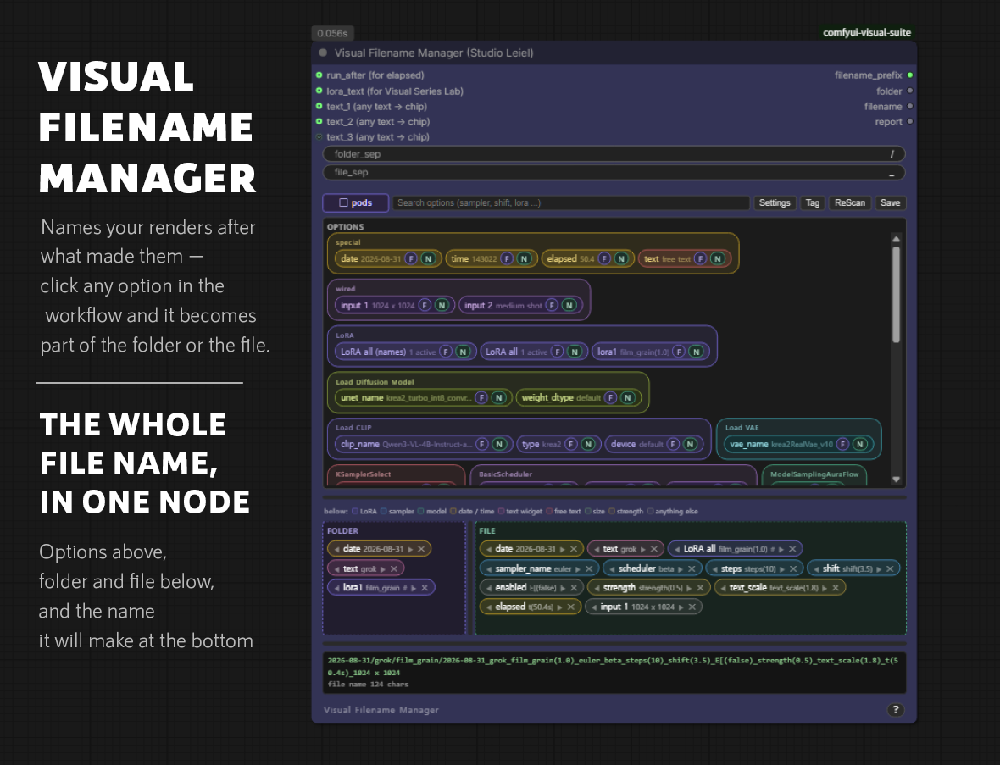
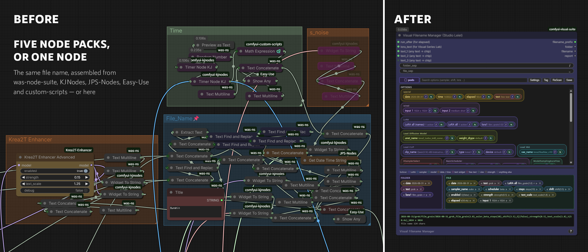
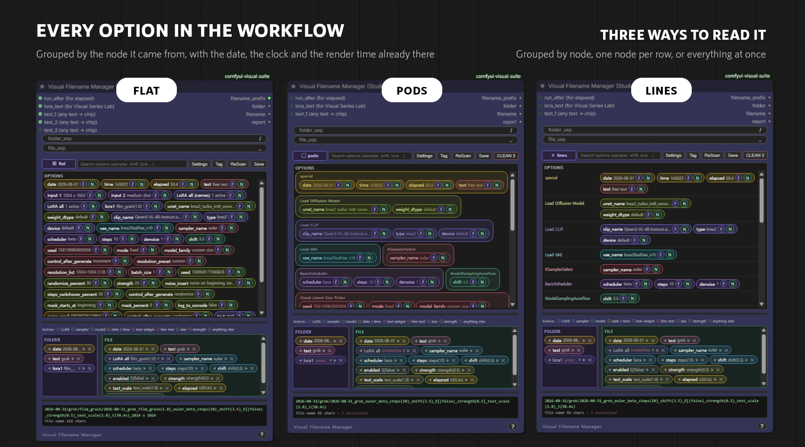
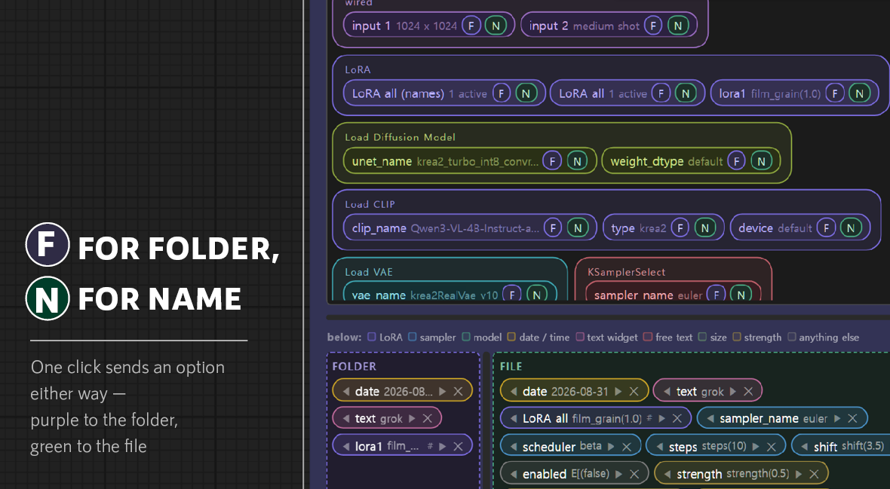
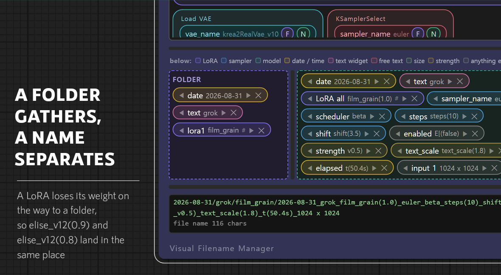
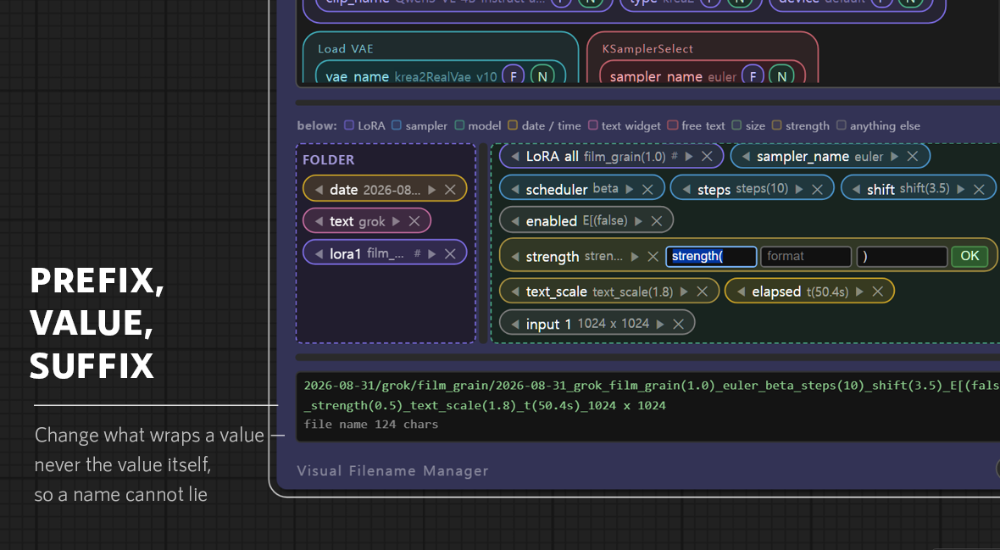

# Visual Filename Manager

Names your renders after what made them — click any option in the workflow and
it becomes part of the folder or the file.

---

## Why the name matters

Anyone who has compared settings in ComfyUI knows the problem. Twenty images
come out of a run and they are called `ComfyUI_00017_`. The one you liked was
made with something — a sampler, a LoRA weight, a shift value — and there is no
way to find out which, because the name kept none of it.

Typing a name per render is not an option when there are sixty of them. So the
usual answer is to build the name out of nodes: one to read a widget, one to
join two strings, one to fetch the date, one to substitute a value. A file name
worth having takes dozens of them, spread across several node packs, and it has
to be rewired every time you want a different setting in the name.

This node reads the workflow instead. Every option in the graph is already
listed; clicking one puts it in the name. Nothing is wired, and adding a setting
to the name costs a click.

---

## The options

Everything in the workflow, grouped by the node it came from, with a search box
to narrow it. Three layouts to read it by: `pods` groups by node, `lines` puts
one node per row, and `flat` runs everything together.

Two groups are not from the graph:

- **special** — the date, the clock, the render time, and a free text field.
- **wired** — anything connected to `text_1` … `text_4`. Some values only exist
  while the graph is running — a size chosen at random, a label computed
  downstream — and cannot be read off the canvas, because the widget showing
  them is drawn after execution. Wire them in and they become chips like any
  other. One socket opens the next, up to four.

`ReScan` rereads the workflow. Values follow the graph live, including nodes
being bypassed and LoRA Manager toggles, but a rescan is there for when
something has moved and the shelf has not noticed.

---

## Sending an option to the name

Every option carries two buttons. `F` sends it to the folder, `N` sends it to
the file. The colours match the boxes below — purple for the folder, green for
the file — so where a click will land is visible before you make it.

The whole thing is built by clicking. Nothing needs typing unless you want to
shorten a label.

Inside a box, drag a chip to reorder it and drag it out to remove it. Order is
worth care: the first thing in a name is what the folder sorts by, so putting
the date first gives you a chronological list and putting the LoRA first groups
by LoRA.

---

## A folder gathers, a name separates

A LoRA sent to the folder loses its weight on the way. `elise_v12(0.9)` and
`elise_v12(0.8)` both land in `elise_v12`, while the file names keep the weights
and stay distinct.

That is the difference between the two boxes. A folder is for gathering things
that belong together; a name is for telling them apart. Carrying the weight into
the folder would split one LoRA across a folder per strength, which is exactly
what you do not want.

`folder_style` in the settings turns this off if you would rather have the
folder carry everything.

---

## Renaming a chip

A chip is three parts: a prefix, the value, and a suffix. The prefix and suffix
are yours to change; the value is not.

That line is deliberate. Shortening `sampler_name` to `s` keeps a name readable
inside the 190-character limit, and wrapping a value as `A(0.5)` lets you invent
your own shorthand. But the value itself always comes from the render, so a file
name cannot end up describing a setting that was never used.

`Tag` drops the option names from the whole file name at once — shorter, at the
cost of having to remember which number was which.

---

## The preview, and the name that is written

The line at the bottom shows the folder and file as they stand, with a character
count.

The name that actually gets written is read as the image is saved, not when you
looked at the preview. If something changes in between — and with the Series Lab
driving the graph, it will — the two can differ. When they do, the written name
is the one that is right: it describes the image that was actually made.

`CLEAN` deals with the other side of that. A chip whose node has been bypassed
has no value any more; rather than deleting it silently, the node marks it and
puts a count on the button. Remove them one at a time, or all at once, or leave
them and un-bypass the node.

---

## Using it with the Visual Series Lab

**Wire `lora_text` from the Series Lab, and leave everything else to the Options
Shelf.**

With an ordinary LoRA loader nothing needs wiring at all: the LoRAs appear on
the shelf like any other option, and a LoRA Manager toggle is picked up live.
The Series Lab is the exception, and for a structural reason — every other node
holds its values on itself, so the shelf can read them, while the Series Lab
decides its values as the queue runs. At the moment the shelf is built there is
nothing to read. `lora_text` is how they arrive.

It matters that they arrive *as chips*. The Series Lab also has a `filename`
output, and using that gives you a name — but it is one finished string, which
cannot be split back into a folder. Wired as `lora_text`, each LoRA becomes a
chip you can send either way, with its real value showing.

Everything except the LoRAs should come from the Options Shelf. The Series Lab
only reports what a recipe actually carried; a setting left out of a recipe
still renders, with whatever the node already had, but it is not in what the
Series Lab passes on. Take your settings from there and the ones you did not put
in a recipe go missing from the name. Take them from both and the ones you did
put in are written twice.

The Options Shelf has neither problem. It reads each value from the node itself
as the image is saved, which is the value that was actually used — whether the
Series Lab set it or it was simply left alone.

---

## Outputs

`filename_prefix` is folder and file together, for a Save Image node.
`folder` and `filename` are the two halves separately. `report` describes what
was resolved and what was not.

---

## Settings

Hidden behind the `Settings` button, because they rarely need touching.

| | |
| --- | --- |
| `max_filename_chars` | 190 by default. A longer name is cut and marked with `~`. Windows path limits make this necessary once a name carries ten options. |
| `resolve_mode` | Where a value is read from: `ui_snapshot` prefers what the canvas shows, `live_prompt` prefers the running prompt. |
| `folder_style` | `names_only` drops values on the way to a folder, as above. `as_is` keeps them. |
| `escape_percent` | Turns `%` into `pct`, so a Save Image node does not treat part of your name as one of its own patterns. |
| `fallback_name` | Used when a name would otherwise come out empty, with the time appended, so no file is ever saved nameless. |

`folder_sep` and `file_sep` set what joins the pieces — `/` and `_` by default.

Illegal characters, trailing dots and spaces, and Windows reserved names like
`CON` are handled without asking.

---

## Saved layouts

`Save` keeps the folder and file arrangement. The current one is saved as you
work, and any arrangement can be kept under a name of its own and brought back
later — useful while trying out how a folder tree should be organised.
