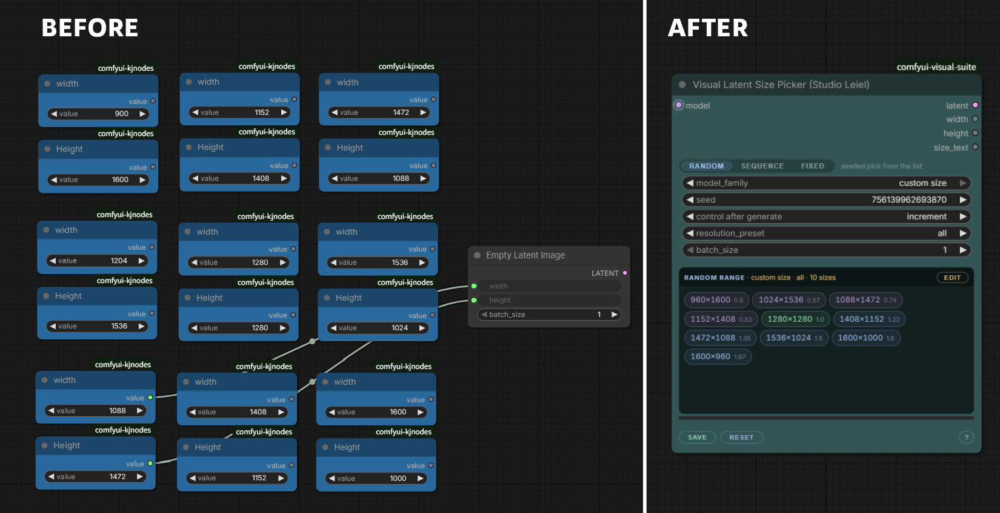
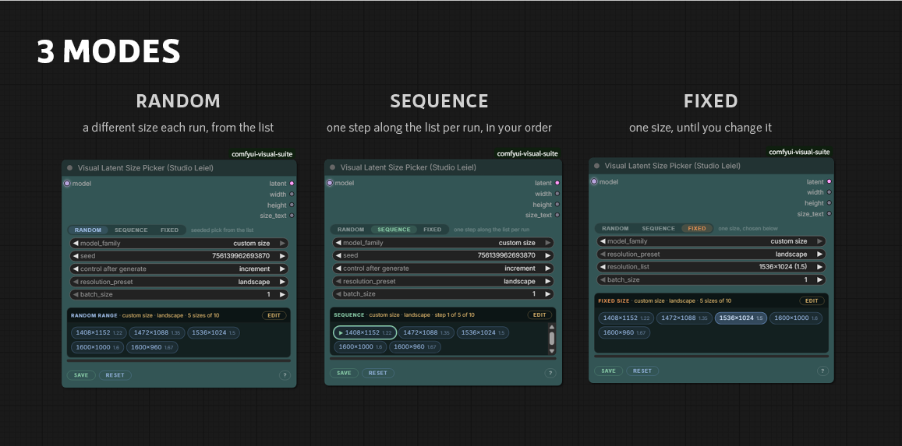
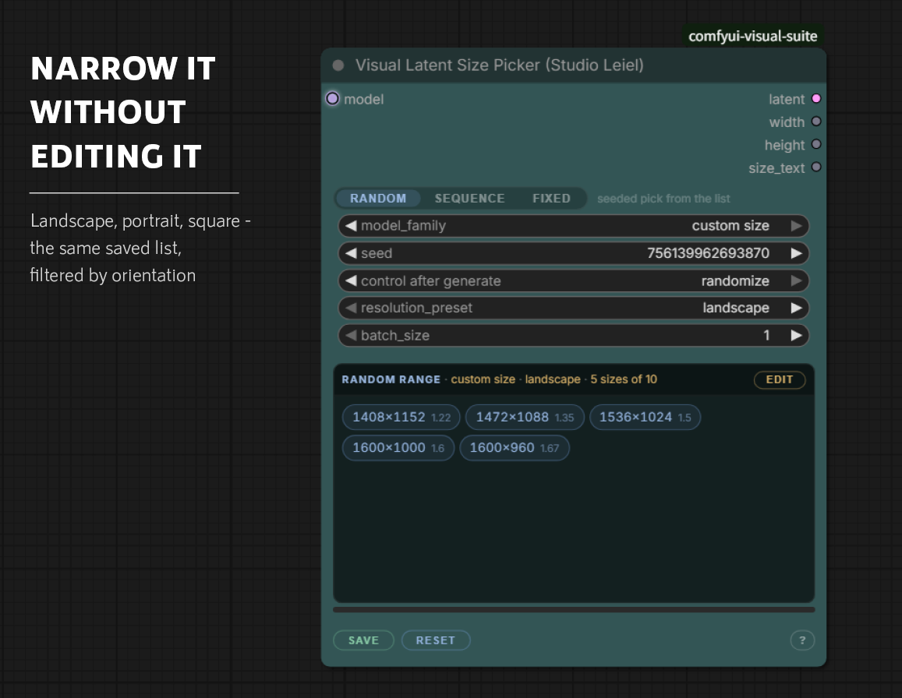
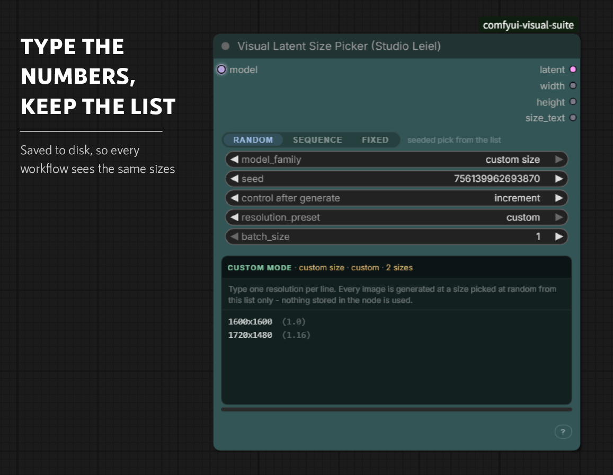

# Visual Latent Size Picker

A list of sizes that lives in one node — picked at random, stepped through in
order, or pinned to one.

---

## Why a list at all

Trying a set of sizes is not a hard idea. It is just tedious enough that most
workflows quietly settle on one aspect ratio and stay there.

The reason is that a node graph has no way to hold a list. A number is a node,
so ten sizes are twenty nodes, and choosing between them needs two switches fed
from the same index — one for width, one for height — plus something to move
that index along. Add a size and the wiring has to be rebuilt. Faced with that,
almost everyone picks one ratio and types over it by hand when they want
another.

So the choice gets made once, early, and never revisited. Not because a fixed
ratio was right, but because changing it was work.

This node holds the list instead. The sizes are stored on disk rather than in
the wiring, which means every workflow sees the same list, editing it once
changes it everywhere, and adding a size costs a line of typing rather than a
rewire.

Two smaller things follow from that. Width and height are always taken as a
pair, so the mismatch you get from feeding two switches separately — 900 wide
by 1536 tall, because one of them moved and the other did not — cannot happen.
And the size is decided from the model that is actually connected, so the latent
comes out with the right channel count and step for it.

---

## What it replaces

Nine sizes as eighteen nodes, and that is only the storage. Nothing in the
picture chooses between them yet.

---

## Three ways to pick

**RANDOM** — a different size each run, drawn from the list with the seed.

**SEQUENCE** — one step along the list per run, wrapping round at the end. The
seed is the step counter, so `control after generate` is set to `increment` when
you switch to this mode. The marked chip is where the next run starts: click a
chip to start there, drag one to change the order. Queue ten runs against a
ten-size list and every size is used exactly once.

**FIXED** — one size, until you change it. Pick it from the dropdown or click a
chip.

The chips are coloured by orientation — blue for landscape, violet for portrait,
green for square — so the shape of the list reads at a glance.

---

## Narrowing without editing

`resolution_preset` filters the same saved list by orientation: `landscape`,
`portrait`, `square`, or `all`. The header says how much of the list is in play
— `5 sizes of 10` — so it is clear you are looking at a subset rather than the
whole thing.

Orientation is worked out from each size's own aspect ratio, so nothing has to
be tagged or maintained.

---

## Your own sizes

`model_family` chooses which table to offer. `custom size` is your own list,
kept at `ComfyUI/user/random_latent_size_picker/custom_sizes.json` — press EDIT
to change it, SAVE to write it, RESET to reload the saved copy. The ratio in
brackets is worked out as you type.

Setting `resolution_preset` to `custom` goes further: nothing stored in the node
is used at all, and only what is typed into the box is. Useful for a one-off set
that does not belong in the saved list.

Built-in tables come with the node for `krea2`, `z-image`, `flux`, `boogu`,
`hidream`, `sdxl` and `sd1.5`, so there is something usable before you have
saved anything of your own. They are a starting point, not the point.

---

## Outputs

`latent`, `width`, `height`, and `size_text` — the last one as `1536 x 1024`,
for wiring into a filename or a note.

`batch_size` behaves as it does anywhere else. One size is chosen per run, so a
batch is that many images at the same size.
