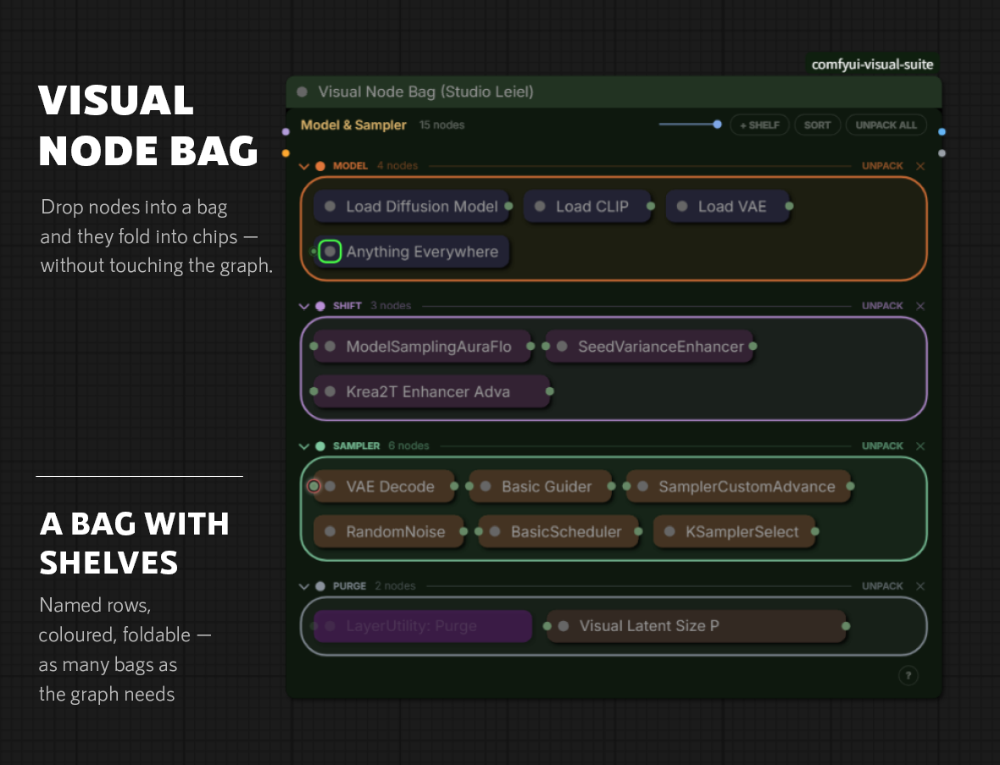
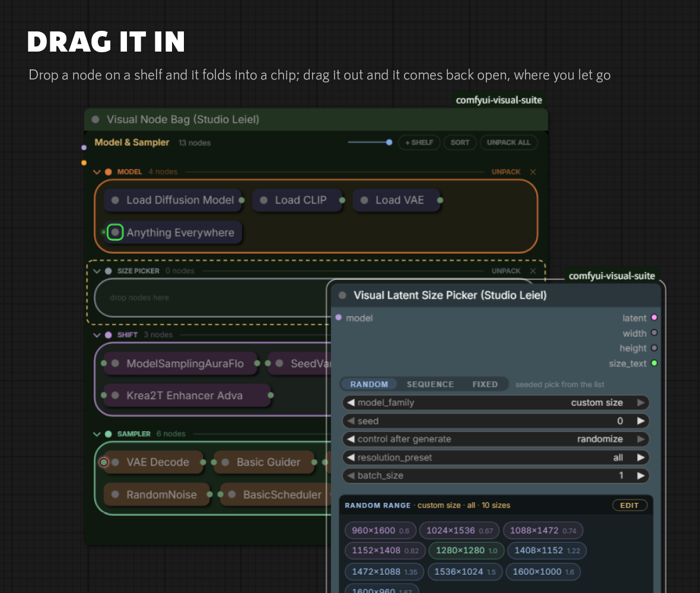
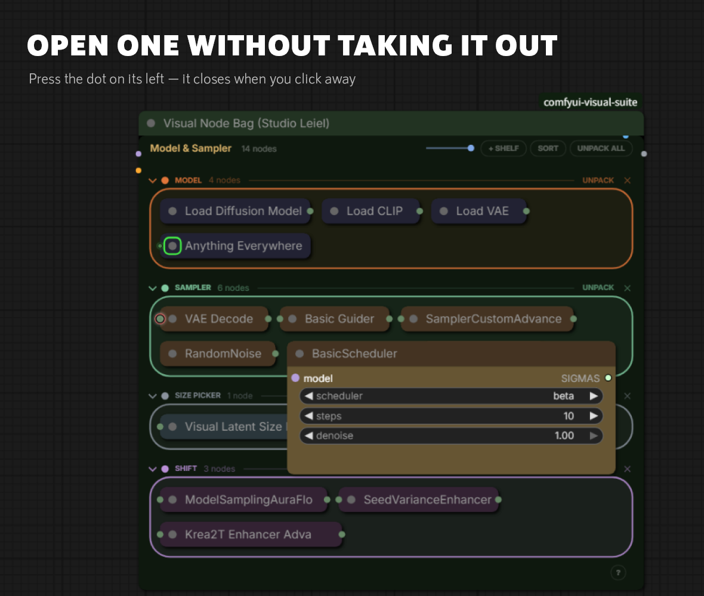
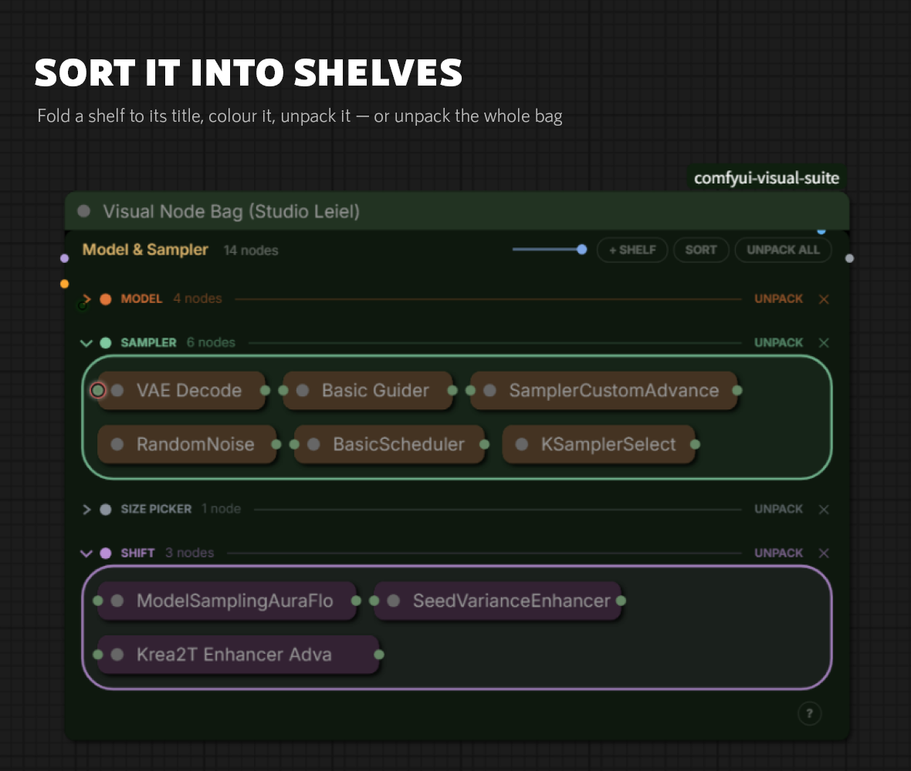
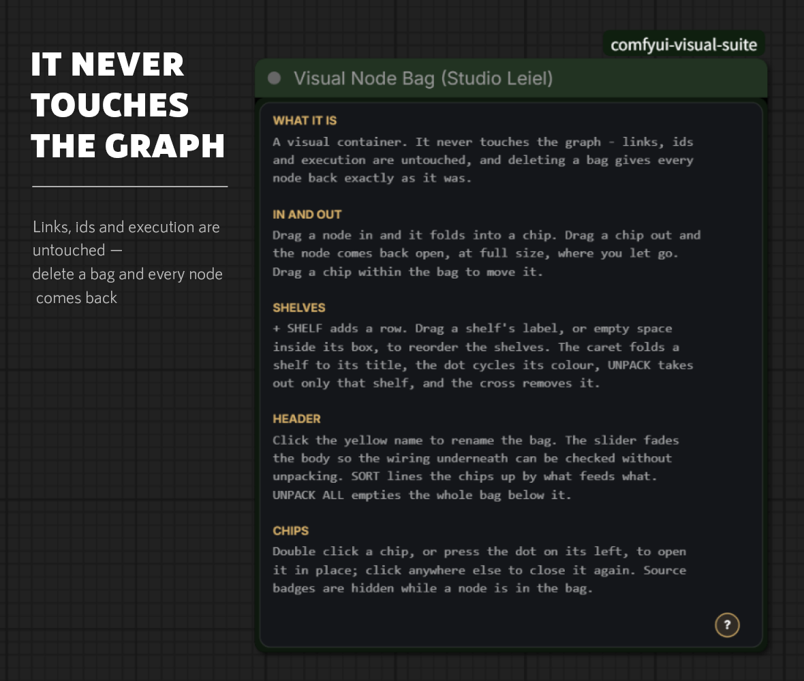

# Visual Node Bag

Drop nodes into a bag and they fold into chips — without touching the graph.

---

## Why put nodes away

Most of a workflow is finished. The loaders were wired months ago, the sampler
chain has not changed in weeks, and none of it needs looking at again. It is
still on screen, though, taking up room and running wires across everything you
are actually working on.

The usual fix is to move it somewhere off to the side, which trades a crowded
canvas for a long journey to get back to it. Groups help a little, but a group
is still all of its nodes at full size.

This is the other option: put them away where they are. The nodes stay exactly
where they were in the graph — same links, same ids, same execution — and stop
taking up the room.

That last point is the whole design. A bag holds a list of node ids, sets their
collapsed flag, and lays them out inside its own rectangle. It does not group,
move, merge or rewire anything, so a workflow runs identically with or without
bags. Delete a bag and every node it held comes back as it was.

---

## In and out

Drag a node so the pointer is over a bag and it folds into a chip. Drag a chip
out and the node comes back open, at full size, exactly where you let go — slid
clear of the bag if it would otherwise land across it. Several selected nodes
dropped together all land on the shelf the pointer is over.

Inside the bag, drag a chip to move it between shelves or reorder it. Dragging
the bag itself carries every chip with it.

Double click a chip, or press the dot on its left, and it opens over the bag as
a popover — change a widget, then click anywhere else and it closes again. There
is no need to unpack a node to adjust it.

While a node is in a bag its source-pack badge is hidden, which is most of what
makes a folded bag look calm.

---

## Shelves

`+ SHELF` adds a named row. Drop nodes straight onto the one you want, drag a
shelf's label or any empty space in its box to reorder the shelves, and click a
name to rename it in place.

Each shelf has a caret that folds it down to just its title, a dot that cycles
its colour, `UNPACK` to take out only that row, and a cross to remove it. A
folded shelf's nodes stay in the graph untouched; they are simply not painted.

`SORT` reorders the chips on each shelf by following the wiring between them, so
a node lands next to the one that feeds it. `UNPACK ALL` empties the bag below
it.

Several bags per workflow is the intended use — one for the model chain, one for
sampling, one for output.

---

## The wires

Links are painted before nodes, so a bag is forced to draw before the nodes it
holds. Its body then covers every wire running underneath it, and wires between
two chips in the same bag disappear completely. Wires to the outside get a dot
in the link's own colour where they cross the bag's edge, so a connection
leaving the bag is still visible as a connection.

The slider left of `+ SHELF` fades the body, for checking the wiring underneath
without unpacking anything.

---

## Small things

The bag's colour is set with ComfyUI's own colour picker and painted a good deal
darker, so a bag reads as a container rather than as another node. Resize it by
the corner as usual; extra height goes to the contents rather than becoming dead
space.

The `?` in the bottom right corner opens a manual over the bag.

Copying and pasting produces new node ids, so a pasted bag comes up empty rather
than pointing at the originals.
