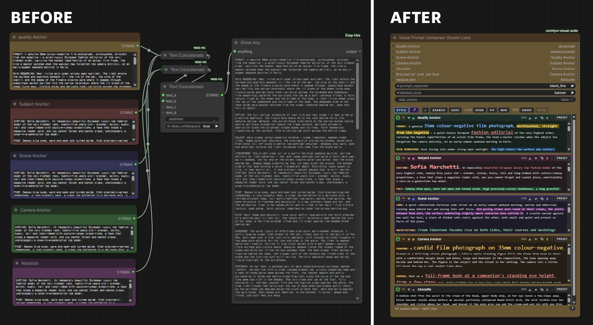
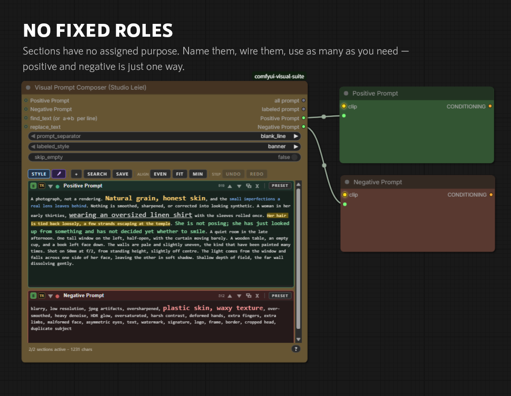
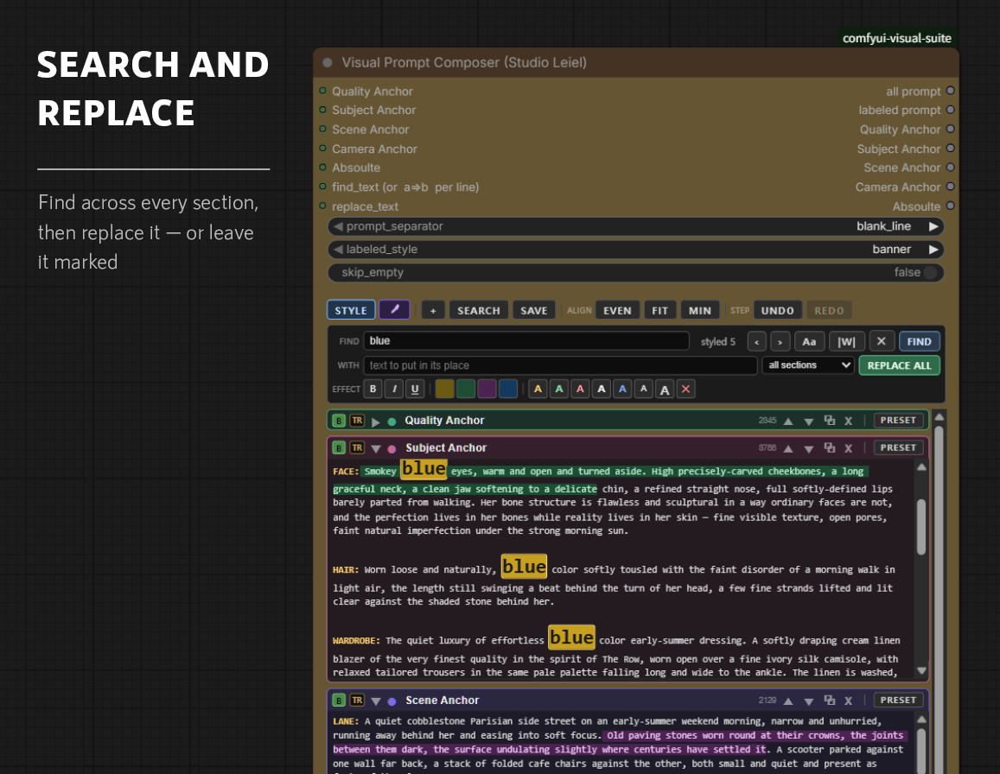
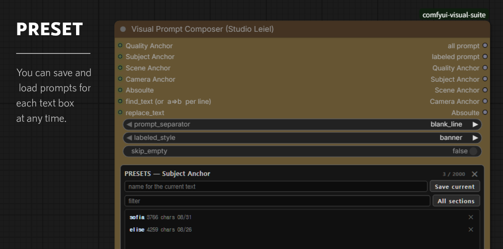

# Visual Prompt Composer

Turns a prompt from a wall of text into a set of parts you can see, switch off,
rearrange and reuse.

---

## Why give a prompt a shape

A model reads a prompt as one flat run of text. You do not. You wrote it in
pieces — the subject, the light, the film stock, the clause you added last month
and never checked again. The moment it is saved, all of that is gone. What is
left is fourteen thousand characters that look exactly alike.

What that costs is attention. Every time you come back you reread the whole
thing to find the part you meant to change, and the rereading is where the time
goes. Marks give the eye somewhere to land. You go straight to the sentence you
are working on and spend your attention on the wording instead of on the search.

They also make a prompt easier to predict. When you can see which sentences
carry the subject and which only set the mood, you can guess what dropping one
will do — and bypass lets you check that guess in a click, without deleting
anything. Do it a few times and you learn which parts of your prompt actually
move the image and which have been riding along for months.

And they remember on your behalf. Underline the phrase you are unsure about,
colour the one you changed for this render, highlight the two that contradict
each other. It is all still there next week, saved in the workflow, when you
have forgotten why you wrote it that way.

None of it costs anything at generation time. The styling is metadata kept
beside the text; what leaves the node is plain. That is the whole reason it is
worth doing — you can annotate as freely as you like without changing a single
token that reaches the model.

---

## What it replaces

A prompt assembled by hand needs a text box per part, a concatenate node per
join, and a preview node to see the result. Change the order and the wiring has
to change with it. Test one part on its own and you delete the rest, then paste
it back.

One node holds all of it, and the parts stay separately addressable.

---

## Sections

Up to eight named sections, each its own text box.

Every section header carries the controls that matter for that section alone:

| | |
| --- | --- |
| **B** | Bypass. The section stays where it is and drops out of the output. |
| **TR** | Opens a translation of this section underneath it. |
| **▾** | Fold the section down to its title. |
| **●** | Section colour. |
| **2845** | Live character count for this section. |
| **▲ ▼** | Move the section up or down. |
| **⧉ ✕** | Duplicate, remove. |
| **PRESET** | Save or load the text of this section. |

Bypass is the one to know. Testing what a part contributes normally means
deleting it and putting it back; here it is one click, the text is never at
risk, and the section keeps its place in the order.

The footer keeps a running total: `5/5 sections active — 14207 chars`.

### Outputs

- **all prompt** — every active section, joined by `prompt_separator`.
- **labeled prompt** — the same with each section's name attached, in the style
  set by `labeled_style`.
- **one output per section** — so a section can go somewhere of its own.

`skip_empty` decides whether an empty section still contributes a separator.

---

## It is not only for one prompt

Nothing ties a section to a particular role. Two sections named `Positive
Prompt` and `Negative Prompt`, each wired to its own encoder, is as valid a use
as five sections feeding one.

---

## Seeing the prompt

Text can be styled: bold, italic, underline, colour, highlight. Select a run of
text and pick an effect, or use the format brush next to `STYLE` to copy the
styling of one piece of text onto another.

**None of it reaches the model.** The styling is metadata stored alongside the
text; the output is plain. `STYLE` toggles the whole display so you can see the
prompt exactly as it will be sent, and switch back.

That is what makes it worth doing. Because the marks cost nothing at generation
time, you can use them for whatever helps you read:

- **Landmarks.** A 14,000-character prompt is unreadable as one block. Colour
  and weight give the eye something to aim at, so you find the clause you want
  instead of scrolling for it.
- **Structure.** Which words carry the subject, which set the light, which are
  there for the film stock. Once it is visible you stop rereading the whole
  thing to find out.
- **Working notes.** Mark the phrase you are unsure about, the one you changed
  last run, the one you keep meaning to cut. It survives in the saved workflow,
  so the note is still there tomorrow.
- **Search results.** A search styles what it finds, which turns a one-off look
  into a mark that stays.

`ALIGN` (`EVEN` / `FIT` / `MIN`) sets how the section boxes share the height,
and `UNDO` / `REDO` step through edits.

---

## Translation

`TR` opens a read-only pane under a section and translates it in place, in 26
languages. Right-to-left languages are laid out right to left.

Hovering a sentence in either pane lights up its match in the other, so a long
paragraph can be checked line against line rather than as a block. The second
dropdown sets how finely the text is cut — paragraph, sentence or clause — which
is also the unit the highlight lines up on.

The source language is detected rather than assumed. Translation runs in the
browser, is never saved, and never reaches the model: the pane is there to be
read, not to change anything.

---

## Search and replace

`FIND` steps through matches across every section, with case and whole-word
options. What it finds can be styled in place, or replaced — in one section or
in all of them at once.

---

## Presets

Any section's text can be saved by name and loaded back later, into that section
or any other. Each entry keeps its length and the date it was saved, and the
list filters as you type.

Presets are stored in ComfyUI's `user/` directory, so updating the pack does not
touch them.

---

## Inputs

`find_text` and `replace_text` are inputs as well as fields, so a search can be
driven from elsewhere in the graph. Each section can also take an input, which
overrides the text typed into it.
