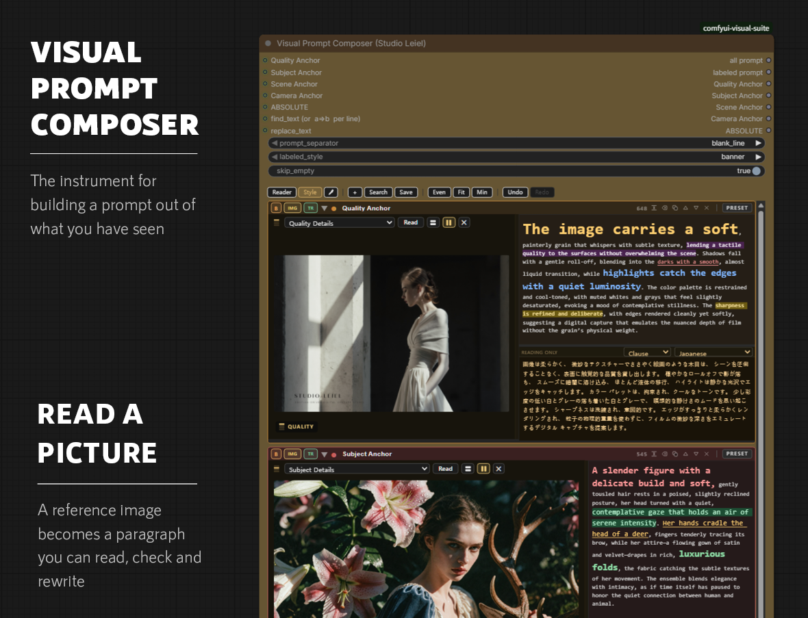
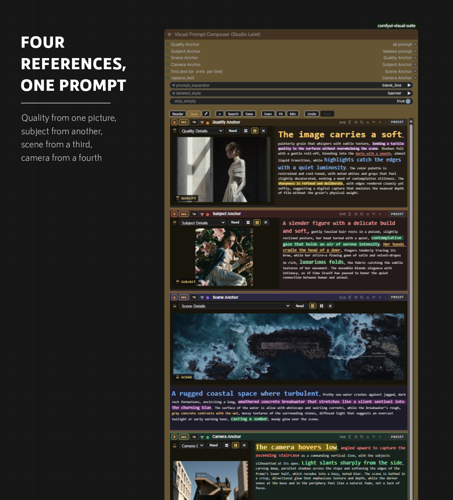
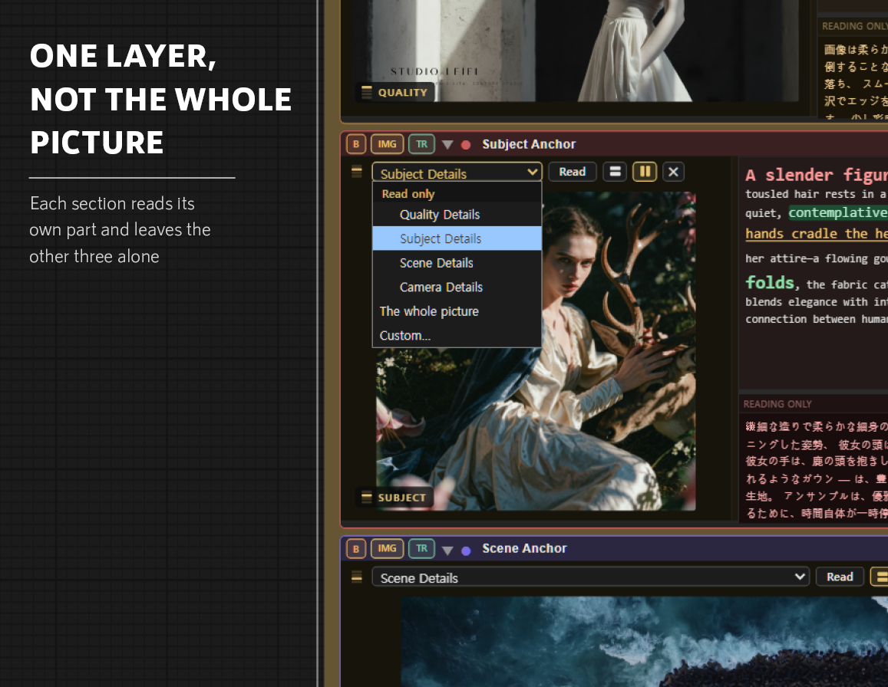
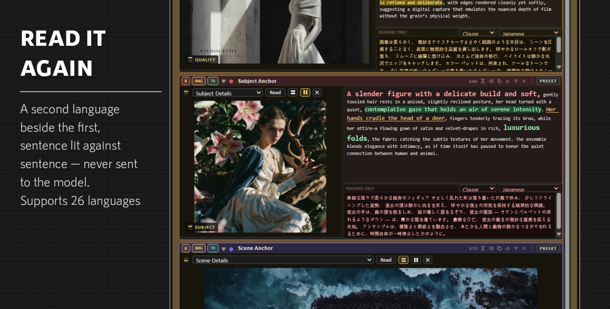
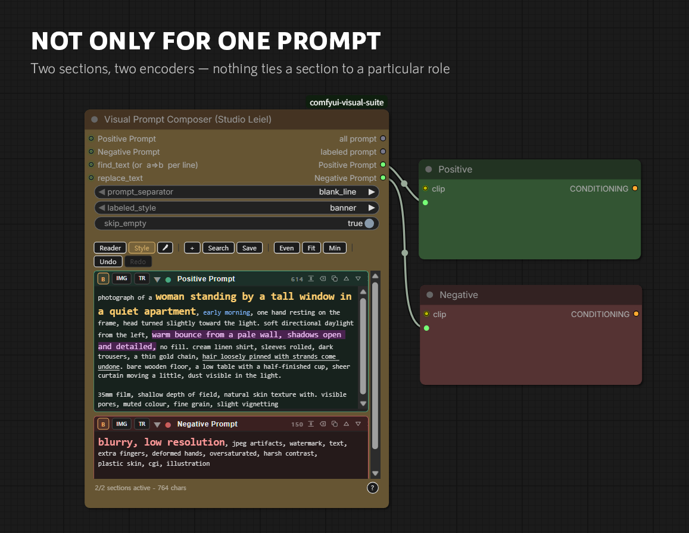
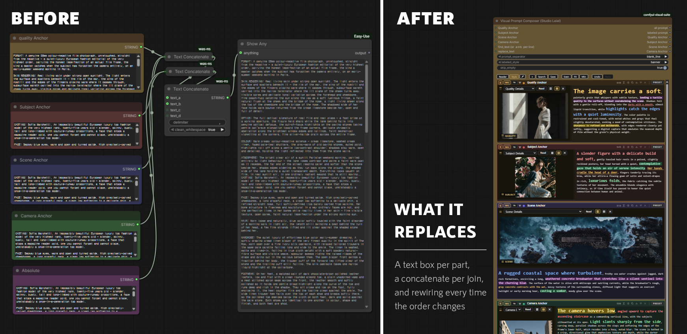
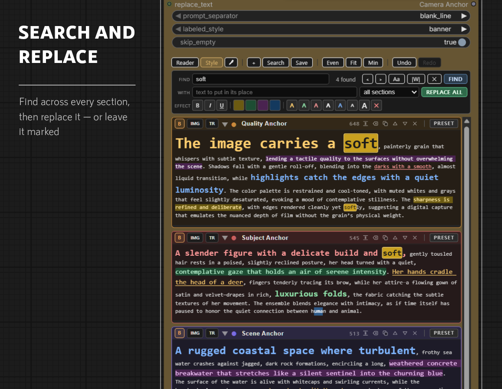
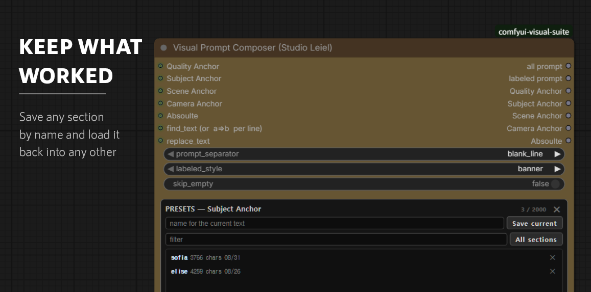
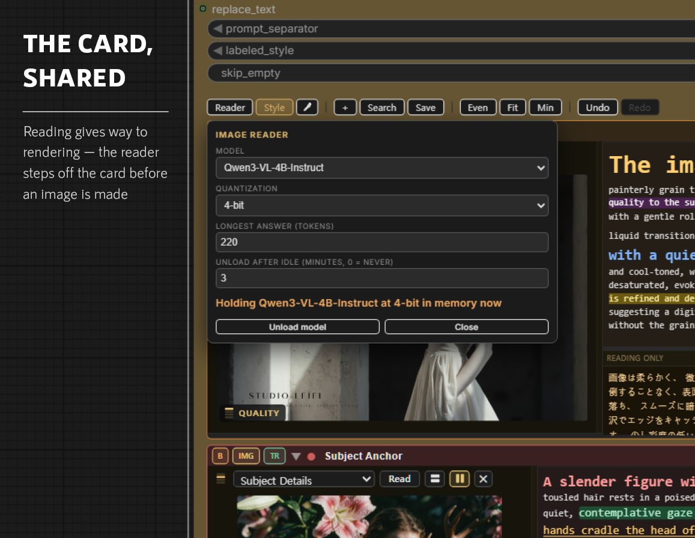

# Visual Prompt Composer

Read a reference image into one layer of a prompt - quality, subject, scene or
camera - and leave the other three to their own references.



---

## What changes when a prompt can be read

A prompt usually arrives as one long string. There is nothing in it to hold on
to - no parts, no seams, nothing you could point at and disagree with. So it
gets pasted in and run, and when the result is wrong the prompt is replaced
rather than examined. You end up downstream of your own writing.

This node changes what a prompt is made of. The text is divided into the layers
it was always made of, each layer can be read out of its own reference image,
each sentence can be marked and coloured while you read it, and a translation
sits beside it so you can check that a line says what you think it says. None of
that is decoration. It is what makes a sentence available for judgement.

Once the text has parts, you can say things about it that could not be said
before: this line is observation and that one is inference, this came from the
reference and that one the model supplied, this is worth keeping and that is
worth rewriting. The prompt stops being an ingredient and becomes work.

So the purpose is not to write your prompts for you. It is to put you inside
them.

---

## Why one layer at a time

Image-to-prompt tools describe a whole picture at once. That is not how a prompt
is built. The quality of a photograph, the person in it, the place it was taken
and the way it was shot are four separate decisions, and they usually come from
four different references.



Here each section reads its own image and is asked its own question. A section
called `Camera Anchor` is asked about angle, distance, depth of field and light,
and told to leave the subject and the setting alone. The one called `Subject
Anchor` is asked the opposite. Four references, four sections, one prompt
assembled from the parts you actually wanted from each.

The questions matter more than the model. They are what stop a camera reading
from drifting into what the person is wearing, and what stop the model inventing
a focal length it cannot possibly know. They are stored where you can edit them.

---

## Reading an image

`IMG` in a section header opens a strip for the picture. Drop a reference image
on it - or copy a screenshot and paste, with the pointer over the strip you mean
- then choose which part of it to read and press `Read`. The answer replaces the
text in that section.



The question is picked from the section's name, so a workflow already laid out
as quality / subject / scene / camera opens ready to use. The menu groups the
four under `Read only`; `The whole picture` and `Custom...` sit outside that
heading because the restriction does not apply to them. Beside the menu, four
stacked bars show which of the four this reading takes and that the other three
are being left to their own sections, and the same mark sits on the picture
itself.

A landscape picture opens above the text and a portrait one beside it, which is
where each has room. The two small squares in the strip move it the other way,
and once you have pressed one that section keeps your choice whatever you drop
on it next. The grip resizes the picture in either arrangement.

`Reader` in the toolbar sets the model, the quantization, the longest answer and
how long the model may sit idle before it is unloaded. What it chooses for you,
and why, is under [Sharing the card](#sharing-the-card).

The reader needs one thing the suite does not require:

```bash
pip install transformers accelerate
```

Run that in the environment ComfyUI runs in, then restart. Everything else on
this page works without it, and the button says plainly when it is missing
rather than failing quietly. Models are downloaded on first use and kept in the
usual Hugging Face cache; `Qwen3-VL-4B-Instruct` is a good place to start.

---

## Where a reference comes from

A picture can be pasted straight in. Copy a screenshot, put the pointer over the
strip you mean, and press paste - the same upload, measurement and arrangement
as a dropped file. Anything on the screen can be a reference without first
becoming a file: a frame paused in a video, a photograph in an article,
something a moment ago you would have had to save, find and drag.

That is a smaller change than it sounds and a larger one than it looks. The cost
of trying a reference falls to almost nothing, and references you would never
have bothered to keep become worth a reading. What comes back is not the
picture. It is a paragraph about grain and contrast, or about where the light is
and how far away the camera stood - the picture's qualities in words, which is a
different thing from the picture, and the reason this is a prompt tool rather
than a copying one.

The layers are what keep it that way, and they are worth using as intended.
Reading all four off a single image is a description of that image and the
result will look like it. Reading the quality from one, the subject from
another, the place from a third and the camera from a fourth is composition -
four decisions you made, assembled. The button that reads one layer and leaves
the other three alone is there so the second is as easy as the first.

---

## Checking what you read

A reading is a claim about a photograph, and some claims are firmer than others.
Deep shadows are something you can verify by looking. A vintage or moody
atmosphere is the model's interpretation, and interpretation is where a reading
drifts. Both arrive in the same sentence, in the same even tone, and telling
them apart is the reader's job.

The tools for that were already here.

Text can be styled: bold, italic, underline, colour, highlight. Select a run of
text and pick an effect, or use the format brush next to `STYLE` to copy the
styling of one piece of text onto another. **None of it reaches the model.** The
styling is metadata stored alongside the text; the output is plain. `STYLE`
toggles the whole display so you can see the prompt exactly as it will be sent,
and switch back.

Because the marks cost nothing at generation time, you can use them for whatever
helps you read - the interpretive phrases in a reading, the clause you changed
last run, the two sentences that contradict each other, the words you keep
meaning to cut. It all survives in the saved workflow.



`TR` opens a read-only pane under a section and translates it in place, in 26
languages, which is a second way to catch a claim that sounded fine in English
and turns out to be vaguer than it seemed. Hovering a sentence in either pane
lights up its match in the other, so a long paragraph can be checked line
against line rather than as a block. The second dropdown sets how finely the
text is cut - paragraph, sentence or clause - which is also the unit the
highlight lines up on. The source language is detected rather than assumed.
Translation runs in the browser, is never saved, and never reaches the model.

One thing neither of them catches: a sentence can be well formed and still
describe something the model never really looked at. A reading of a plain
backdrop will report confidently on a depth of field there is no depth to have.
For that, compare the words against the photograph.

---

## Sections

Up to eight named sections, each its own text box.

Every section header carries the controls that matter for that section alone:

| | |
| --- | --- |
| **B** | Bypass. The section stays where it is and drops out of the output. |
| **IMG** | Opens the reference strip for this section. |
| **TR** | Opens a translation of this section underneath it. |
| **▾** | Fold the section down to its title. |
| **●** | Section colour. |
| **444** | Live character count for this section. |
| fit | Fit this section to the text it holds. |
| clear | Empty this section's text, keeping its picture, colour and title. |
| copy | Duplicate the section. |
| **△ ▽** | Move the section up or down. |
| **✕** | Remove the section. |
| **PRESET** | Save or load the text of this section. |

Bypass is the one to know. Testing what a part contributes normally means
deleting it and putting it back; here it is one click, the text is never at
risk, and the section keeps its place in the order.

Dragging a section's bottom edge resizes it. With a translation open the new
room goes to the translation rather than to the text box, since a box you can
already read is rarely the one that needed the space. Hold Shift to trade height
with the section below instead of growing the node.

The footer keeps a running total: `5/5 sections active - 14207 chars`.

### Outputs

- **all prompt** - every active section, joined by `prompt_separator`.
- **labeled prompt** - the same with each section's name attached, in the style
  set by `labeled_style`.
- **one output per section** - so a section can go somewhere of its own.

`skip_empty` decides whether an empty section still contributes a separator.

---

## It is not only for one prompt

Nothing ties a section to a particular role. Two sections named `Positive
Prompt` and `Negative Prompt`, each wired to its own encoder, is as valid a use
as five sections feeding one.



`ALIGN` (`EVEN` / `FIT` / `MIN`) sets how the section boxes share the height,
and `UNDO` / `REDO` step through edits.

---

## What it replaces

A prompt assembled by hand needs a text box per part, a concatenate node per
join, and a preview node to see the result. Change the order and the wiring has
to change with it. Test one part on its own and you delete the rest, then paste
it back.



One node holds all of it, and the parts stay separately addressable.

---

## Search and replace



`Search` steps through matches across every section, with case and whole-word
options. What it finds can be styled in place, or replaced - in one section or
in all of them at once.

---

## Presets



Any section's text can be saved by name and loaded back later, into that section
or any other. Each entry keeps its length and the date it was saved, and the
list filters as you type.

Presets are stored in ComfyUI's `user/` directory, so updating the pack does not
touch them. The reader's questions are kept in the same place and can be edited
there.

---

## Sharing the card

Reading an image and rendering one both want the graphics card, and on one card
they cannot both have it. The reader is the guest here: rendering is the work,
reading is the errand, and the errand gives way.



So the two are never resident at the same time. `Read` is greyed out while
ComfyUI has anything queued or running, and comes back on its own when the queue
empties. Queue a render while the reader is loaded and the reader is unloaded at
once, whatever its idle timer had left to run - waiting three more minutes
holding several gigabytes is the wrong thing to do while an image model is
trying to load. After a spell with no reading it unloads anyway.

Defaults come from the card. The total memory is read at startup and used to
pick a starting model, a quantization and an idle time; the Reader panel says
what it found, what it suggests when your settings differ from it, and what is
in memory at any moment. Any setting you change is yours and is never
overridden. 4-bit is the default at every size - it costs about three seconds a
reading and saves several gigabytes, and on the layer questions here the loss is
slight.

What it deliberately does not do is manage ComfyUI's memory. An earlier version
asked ComfyUI to unload its models before reading, which seemed reasonable and
was not: after a render ComfyUI holds its model patched and ready, and unloading
that from outside, at a moment of this node's choosing, left the patcher half
restored and killed the next render with an error pointing deep into ComfyUI and
nowhere near here. ComfyUI frees its own memory when something else asks the
card for room. It only needs to not be asked in the middle of a render, and that
is what the greyed-out button is for.

None of this makes a small card large. On 8-12GB the 2B model at 4-bit is the
realistic choice, and setting the idle time to 1 keeps the reader off the card
between readings.

---

## Inputs

`find_text` and `replace_text` are inputs as well as fields, so a search can be
driven from elsewhere in the graph. Each section can also take an input, which
overrides the text typed into it. An input wired from another Prompt Composer is
read from its layout, so the section it came from shows through live rather than
waiting for a run.
