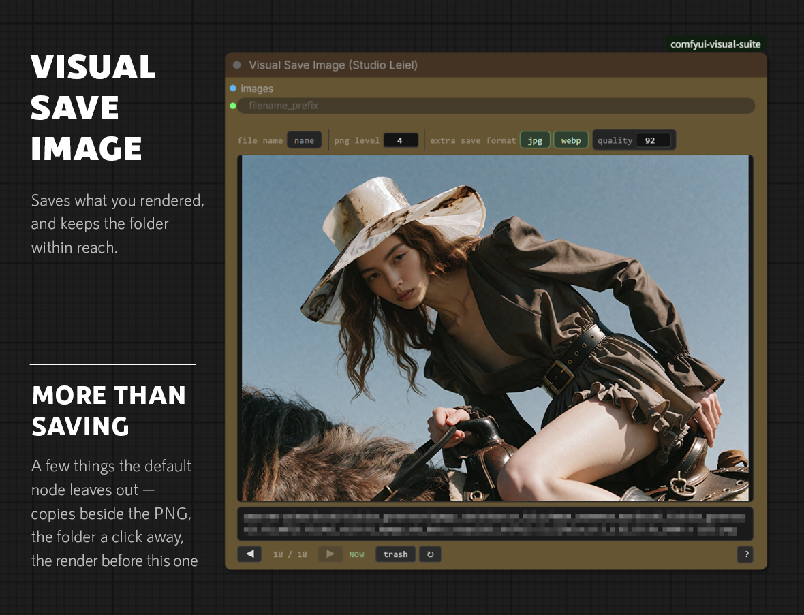
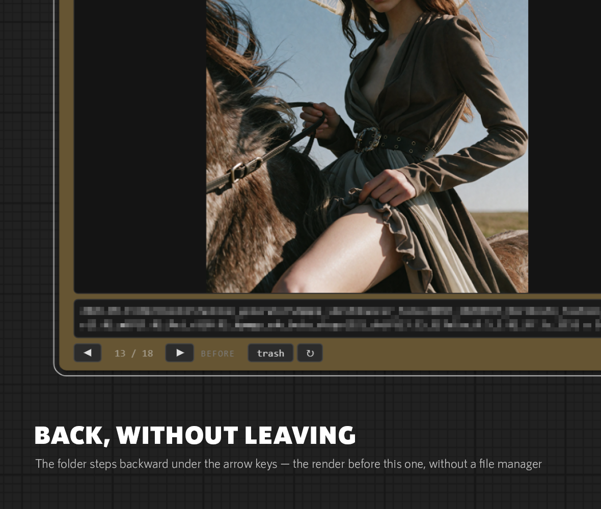

# Visual Save Image

Saves what you rendered, and keeps the folder within reach.

---

## Why the counter has to go

ComfyUI's Save Image appends a five digit counter to whatever name it is
handed: `name` comes out as `name_00001_.png`. The counter is scoped to the
prefix, so it only counts up when the prefix is reused.

A name that carries the date, the series, the LoRAs, the sampler and the size
is different on every render. The counter therefore reads `00001` every time,
on every file, for ever — seven characters that say nothing, on a name already
long enough to be arguing with the Windows path limit. Long enough, in fact,
that Windows stops offering to put the file in the recycle bin and asks you to
delete it outright instead, because the name plus the restore record no longer
fits.

So this node writes the name it is given, and nothing else.

Everything around that is unchanged, because the rest of ComfyUI depends on it:
the same output folder, the same prompt and workflow metadata written into the
PNG, the same preview handed back to the browser.

If you want the counter, press `file name` and it comes back — a plain prefix
with nothing else to tell one render from the next is exactly what it is for.

---

## Looking back through the folder

The second half of the node is the part that is hard to give up.

A render finishes. You want to see the one before it — was the hat better at
strength 0.9? Normally that means a file manager, a folder eight levels deep, an
image viewer, and finding your way back to ComfyUI. The comparison takes four
seconds; getting to it takes thirty, and by the time you are back you have lost
the thread.

The arrows step through the folder this render went into, one render at a time,
without leaving the canvas.

**Give the Filename Manager a `seq` chip at the front of the file name.** Sorted
by name, a folder of long descriptive names is in no useful order at all — they
begin with whatever the first chip happens to be. A number at the front makes
name order and render order the same thing, and the arrows then walk time.
Without it this still works; it simply walks the alphabet instead.

- **`NOW` / `BEFORE`** — whether you are looking at the render that just
  finished or an earlier one.
- **Left and right arrow keys** do the same as the buttons, with the node
  selected. Nothing is bound while you are typing in a field, and nothing is
  bound when two nodes are selected.
- **Click the picture** to open it full size in a new tab. **Click the name** to
  copy it.
- **`↻`** reads the folder again, for when files have been moved or deleted
  outside ComfyUI.

The folder is remembered with the workflow. Open it tomorrow, or on a fresh
start, and the last render is already on screen marked `BEFORE`, with the arrows
live. Nothing has to be rendered first.

---

## Throwing one out

`trash`, or `t` with the node selected, moves the picture out of the way and
steps on to the next one.

It is a move, not a delete. The file goes to a `_trash` folder inside output,
under the path it came from — `_trash/2026-09-15/Norikoshi/…` — so a file put
back by hand goes back where it belongs, and two renders that share a number
from different days cannot overwrite each other. Any `jpg` or `webp` copy of the
same render goes with it.

The folder is never emptied for you. Emptying it stays something you do
deliberately, in a file manager.

`put back` undoes it, newest first, for as many as were thrown out this session.
After a reload the list is gone and the files are moved back by hand — which is
why the trash keeps the path.

There is no confirmation dialog, on purpose. This is meant to be used while
going through a folder at speed, and a dialog on every press would defeat it.
The safety is that nothing is destroyed.

`t` rather than `Delete`: `Delete` removes the node itself on this canvas, and
it sits right beside the arrows your hand is already on.

---

## Lighter copies

`jpg` and `webp` write a second file beside the PNG, under the same name, at
full size. Either, both, or neither; `quality` applies to both.

The PNG is written first and is never affected. A copy that fails to write is
reported in the console and otherwise ignored — it must never cost the render it
was made from.

For a 1024 × 1536 render: PNG 4.6 MB, JPEG at 90 about 2.9 MB, WebP at 90 about
1.3 MB. There is no resize option. What a copy is wanted for is the weight, and
WebP is already near a quarter of the PNG without touching a pixel; the size
something has to be is decided by wherever it is going, and that is a question
for then.

`png level` is compression only. PNG is lossless at every setting — the number
changes the file size and the time taken, never the picture. 4 is what Save
Image uses and there is rarely a reason to move it.

---

## Using it

Connect `images`, and wire the Filename Manager's `filename_prefix` output into
`filename_prefix`. Or type a name there as you would for Save Image, folders and
all.

Everything else is on the bar under the picture.

| Control | What it does |
| --- | --- |
| `file name` | `name` writes the name as given; `name_00001_` appends the counter. |
| `png level` | PNG compression, 0–9. Lossless either way. |
| `jpg` `webp` | Write a lighter copy beside the PNG. |
| `quality` | Quality of those copies, 1–100. Greyed out when neither is on. |
| `◀ ▶` | Step through the folder, in name order. |
| `trash` | Move this render to `_trash`. |
| `put back` | Undo that, newest first, this session. |
| `↻` | Read the folder again. |
| `?` | The manual, on the node. |

Two renders can still land on the same name — the same recipe run twice in the
same second, or a batch, where the name is built once and handed to every image
in it. The second gets a short suffix rather than overwriting the first. A
render that has finished is never thrown away.

---

## Outputs

None. This is an output node: it writes files and shows them.
