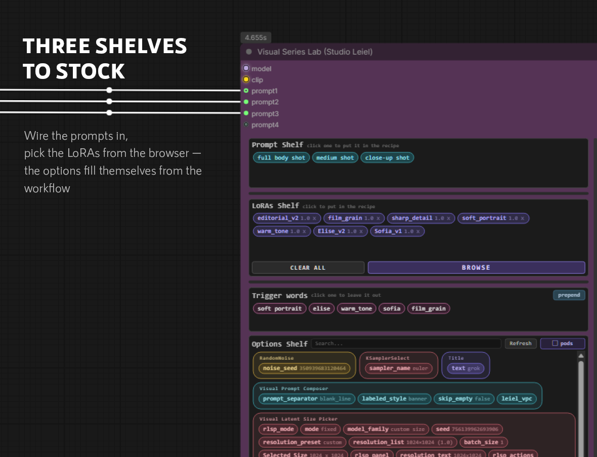
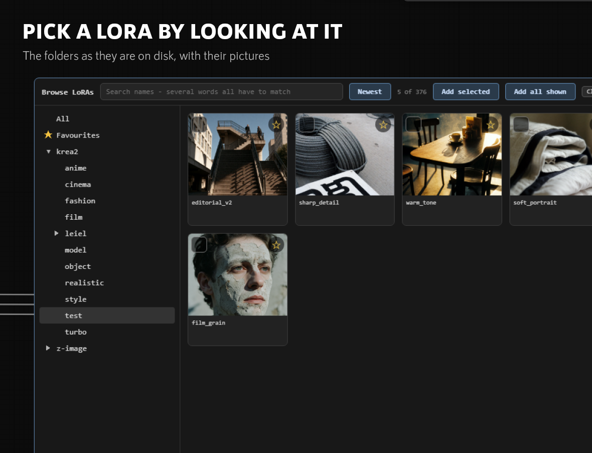
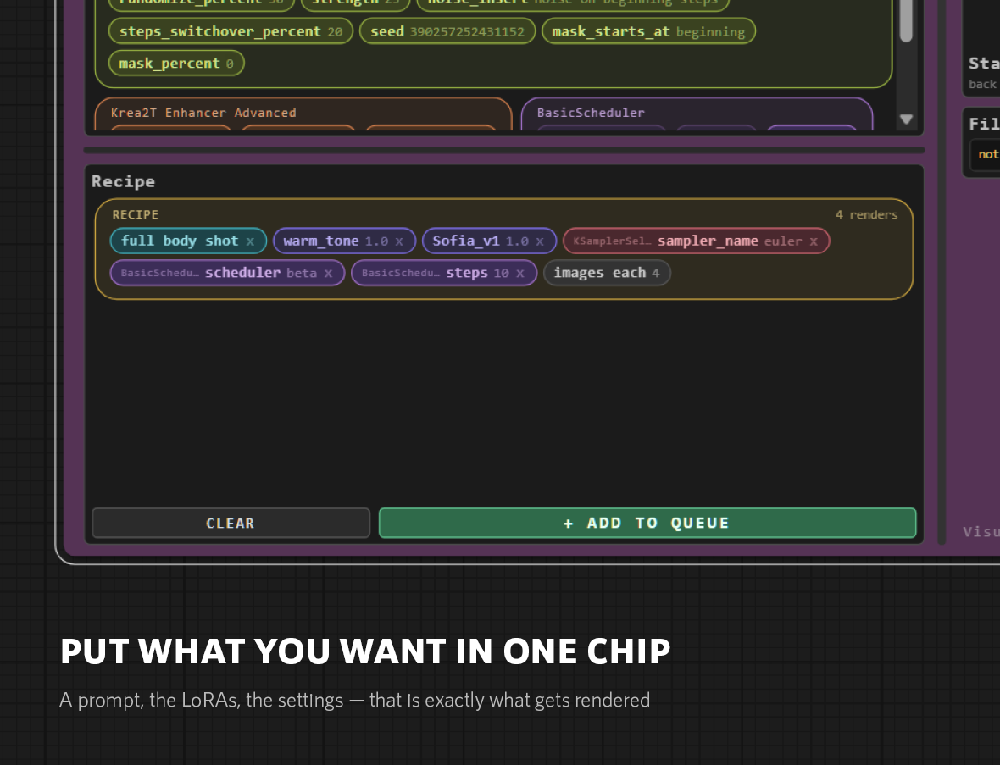
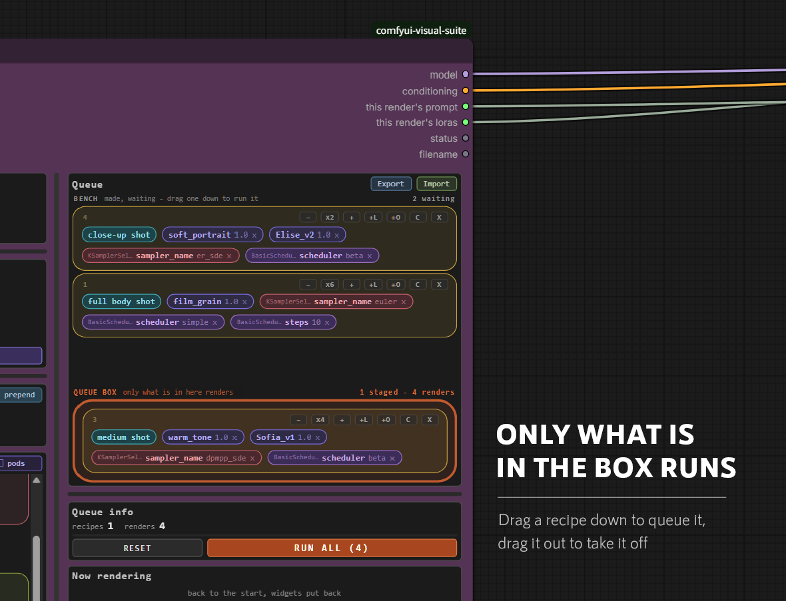
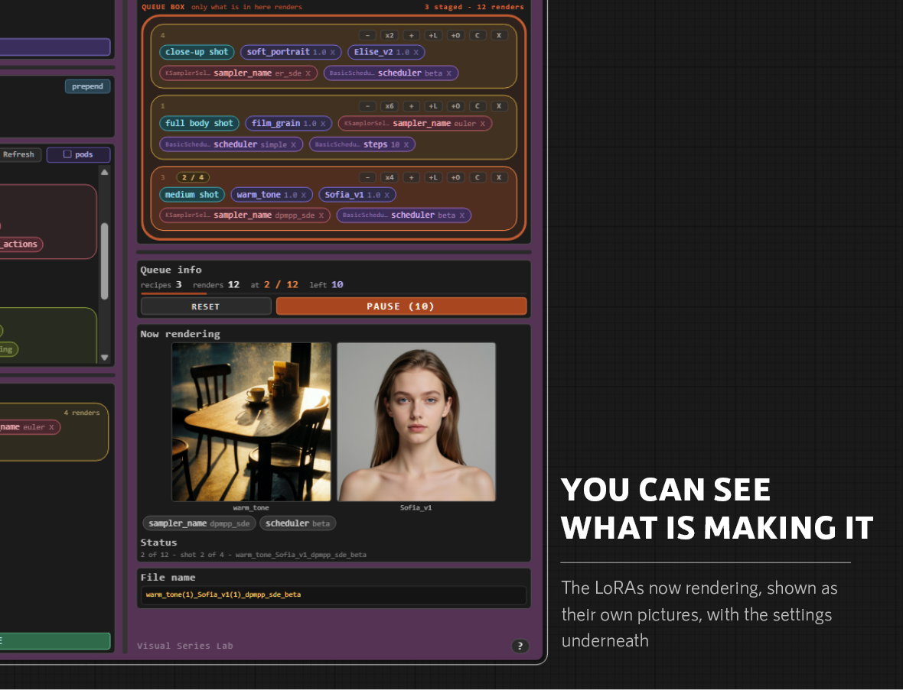
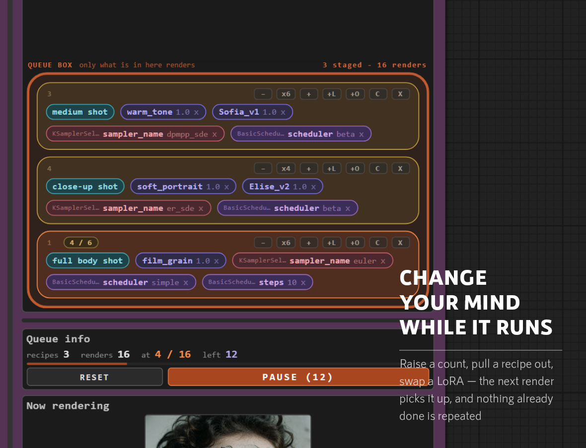
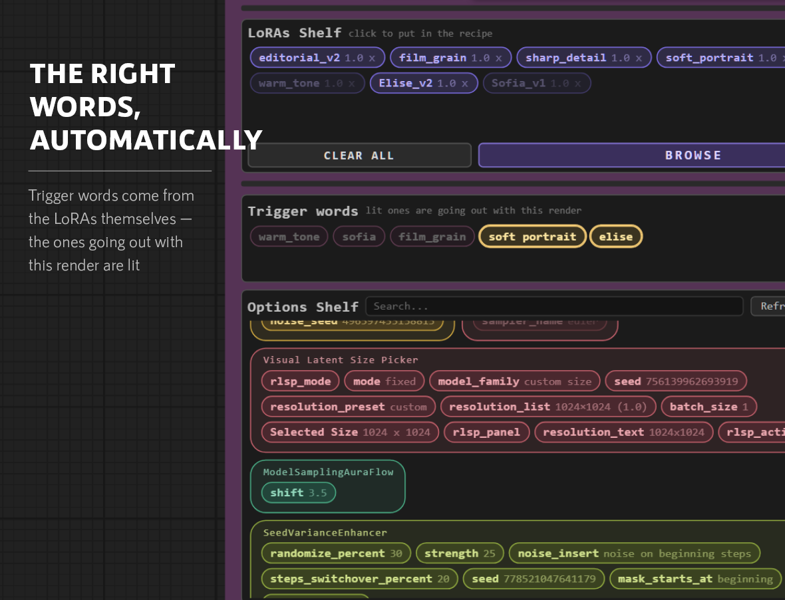

# Visual Series Lab

Ingredients on shelves, combined into recipes, cooked one after another — a
render queue you can see into and change while it runs.

---

## Why this exists

ComfyUI renders one thing at a time. You set the graph up, queue it, and when it
comes back you change something and queue it again. Nobody complains about that;
it is simply how it works, so the work gets shaped around it.

Testing a new series means finding which style suits it. Five or six candidate
LoRAs, four or eight variations each, and the queue is already forty deep. Add
one more LoRA, or an enhancer, and it is sixty.

ComfyUI will render all sixty. What it will not do is tell you which one you are
looking at, or let you change your mind. A queued run is a sealed box: you watch
a LoRA you already dislike render its remaining twelve images, or you work out
where they sit in the order and cancel them one at a time, counting in your
head.

This node keeps the queue open. Every render says which prompt, which LoRAs and
which settings made it, while it is happening. A recipe that turns out badly can
be pulled out mid-run; one that turns out well can have its count raised on the
spot. Nothing already rendered is repeated.

What changes is not the time spent rendering. It is that the size of an
experiment stops being limited by how long you are willing to sit in front of
the machine.

---

## The shelves

**Prompt Shelf** — one chip per prompt wired into the node, named after
whatever it is connected to. Connect a text node to `prompt1` and a chip
appears; the next socket opens as soon as that one is used, up to six. Right
click to rename a chip. A name you type is dropped again if you rewire that
socket to something else, so a chip never keeps the old thing's name.

**LoRAs Shelf** — whatever was picked in BROWSE. Hover a chip to see its
picture; click to reserve it for the recipe, `x` to take it off the shelf.

**Trigger words** — read from the LoRAs themselves, so the words that belong
with a LoRA arrive with it. Click one to leave it out. While a render is on its
way, the words actually going with it are lit and the rest are dimmed. `prepend`
decides whether they go before or after the prompt.

This matters more than it sounds. Comparing five LoRAs by hand, it is easy to
leave the last one's trigger word in the prompt, or forget the new one's — and
then you cannot tell whether the LoRA was bad or the words were wrong.

**Options Shelf** — the widgets of every other node in the workflow, listed
without wiring anything. Search to narrow it, `Refresh` to rescan, and three
layouts to read it by: `pods` groups by node, `lines` puts one node per row, and
`flat` runs everything together.

---

## Browsing LoRAs

Every LoRA on disk, in the folders it actually sits in, with its preview
picture. The tree folds — the arrow opens a branch, the name selects it — and a
folder shows everything underneath it, not only what sits directly in it.

Search looks at file names first and falls back to folder names when nothing is
named that. Several words all have to match, and spaces, underscores and dashes
count as the same thing. Favourites have a shelf of their own.

---

## Recipes

A recipe is one prompt, the LoRAs you want with it, and the settings you want
changed. Click the chips on the shelves to bring them down. One prompt per
recipe, and it is required — a recipe without one cannot render.

`+ ADD TO QUEUE` leaves the recipe standing, so changing one thing and adding it
again builds a series in a few clicks.

A recipe carries only what you put in it. Anything you leave out keeps whatever
the node already has, and the values written for a render are put back
afterwards — a recipe changes the graph for one picture and leaves it as it was.

### Sweeping a setting

Give a setting more than one value and every one is rendered. Values multiply:
two samplers, two strengths and four images each is 2 × 2 × 4 = 16 renders. Pick
several from the list for a setting that has one, or separate numbers with
commas. The count on the recipe updates as you build it.

---

## Bench and queue box

A queued recipe lands on the **bench**, where it waits. Drag it down into the
**queue box** to have it rendered — only what is in the box runs, from the top
down. Drag to reorder, or drag one back out to take it off the run.

Each recipe keeps the number it was given when it was made. Not its position:
its own number, which never changes wherever it moves and whatever is deleted
around it. That is what makes the rest of this safe. Renumbering on every change
would mean that pulling one recipe out leaves you unsure which of the others you
are looking at, and an editable queue nobody dares edit is no better than a
sealed one.

A recipe that finishes leaves the box and goes back to the bench marked `done`,
so the box always holds only what is left. Put it in the box again and it starts
over.

---

## While it runs

**Now rendering** shows the LoRAs going into the picture that is being made — as
their own pictures, not as file names in a list — with the settings underneath.
The status line and the file name say the same thing in words.

All of the editing works during a run. Raise or lower a recipe's count with the
buttons either side of `x4`, add a LoRA with `+L` or an option with `+O`, copy
one with `C`, remove it with `X`, drag a new recipe in or an old one out. Each
render is set up fresh, so a change is picked up by the next picture rather than
the next run.

The counts follow every change at once. `recipes 3 · renders 16 · at 2 / 16 ·
left 14` is the whole state of the run in one line, and `PAUSE` stops it where
it is.

---

## Outputs

`model` and `conditioning` carry the render.

`this render's prompt` and `this render's loras` name what went into the picture
on its way out, and `filename` is a name describing the combination —
`warm_tone(1)_Sofia_v1(1)_dpmpp_sde_beta`. All three are meant for a file
manager node downstream, so that what the screen tells you during a run, the
file name tells you afterwards.

`status` says where the run has got to.

---

## Keeping a plan

Everything — the shelves, the recipe, the queue and how far it has got — is
saved with the workflow.

`Export` writes the queue to a JSON file, anywhere you like. `Import` adds a
file to what is already there rather than replacing it, so two plans can be
merged.

That makes a queue a template rather than a backup. A setup that compares five
LoRAs at four images each can be exported once, and the next series only needs
its prompts swapped.
